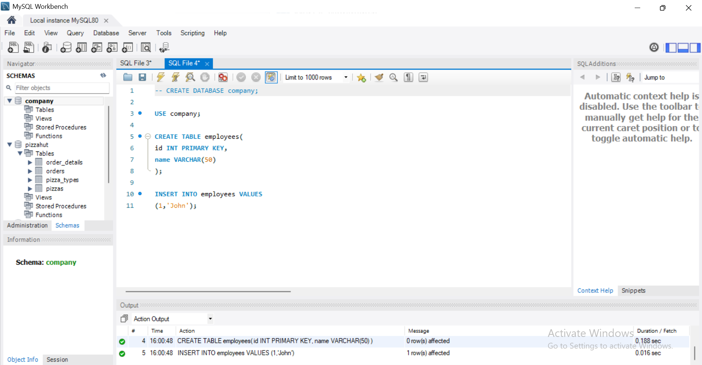
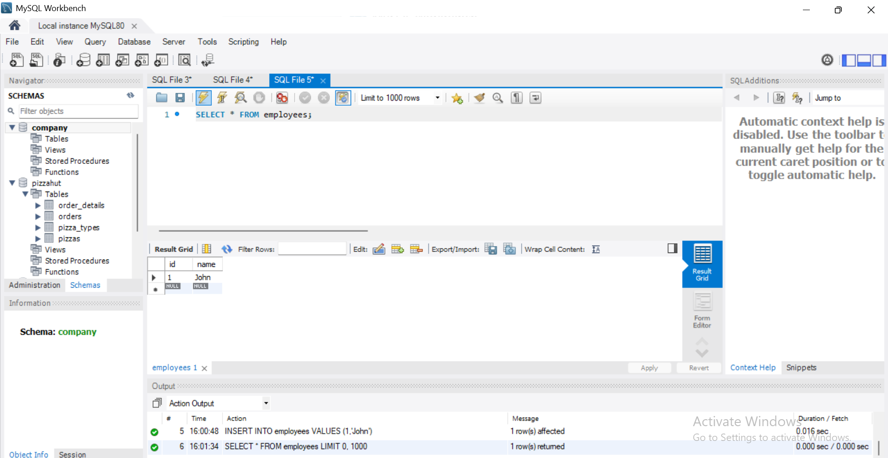
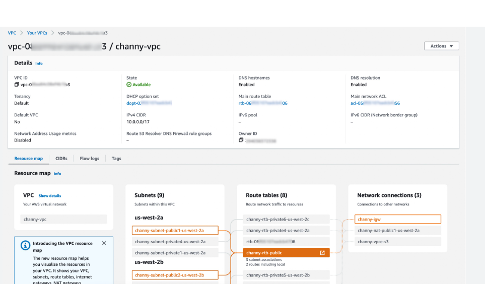
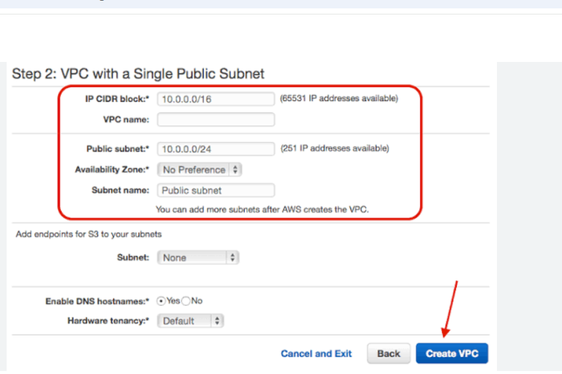
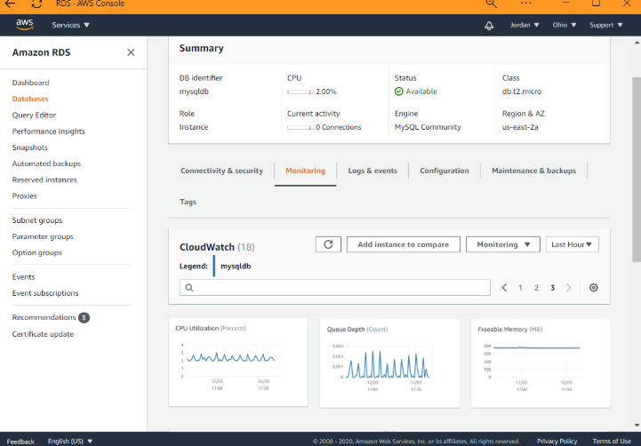
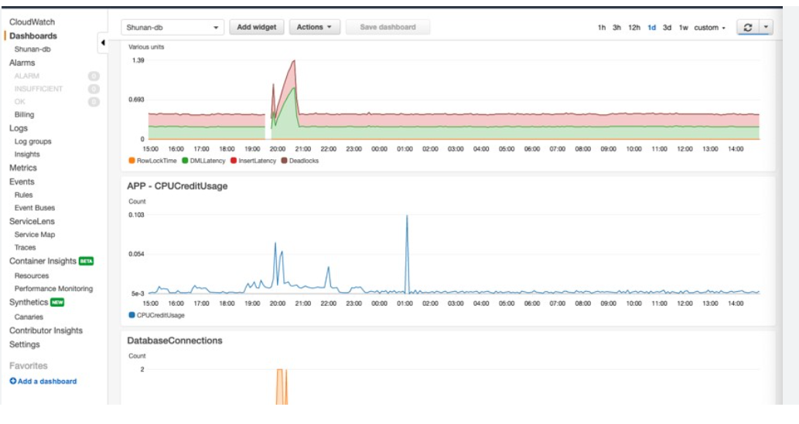

# AWS-week-3-assignment-

# ☁️ Cloud Computing with AWS – Week 3 Assignment

This repository contains the implementation and screenshots for Week 3 assignment.

---

## 📌 Objective
- Understand AWS VPC setup
- Learn RDS (Relational Database Service)
- Perform SQL operations using MySQL Workbench
- Monitor database using CloudWatch

---

## 🛠️ Technologies Used
- AWS (VPC, RDS, CloudWatch)
- MySQL Workbench
- SQL

---

## 🧱 Steps Performed

### 1️⃣ Database Creation (MySQL)
- Created database `company`
- Created table `employees`
- Inserted sample data

📷 Screenshot:

---

### 2️⃣ Data Retrieval
- Used `SELECT * FROM employees;` to verify data

📷 Screenshot:

---

### 3️⃣ VPC Setup (AWS)
- Created custom VPC
- Configured public subnet

📷 Screenshots:
  

---

### 4️⃣ RDS Setup
- Created MySQL RDS instance
- Checked connectivity and status

📷 Screenshot:

---

### 5️⃣ Monitoring with CloudWatch
- Monitored CPU usage
- Checked DB connections

📷 Screenshot:

---

## ⚠️ Note
AWS resources may not be created using personal accounts due to billing requirements. Screenshots are used for demonstration purposes.

---

## ✅ Conclusion
This assignment helped in understanding:
- Cloud networking using VPC
- Managed database using RDS
- Monitoring using CloudWatch
- SQL operations in MySQL

---
**Author** = Shreya jha 
